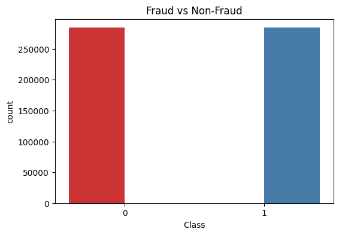
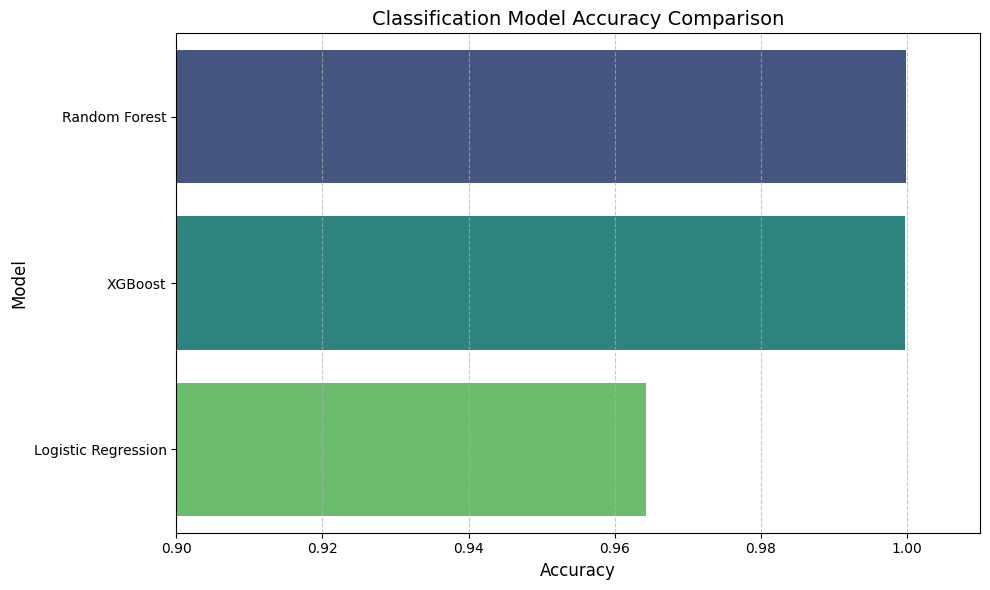
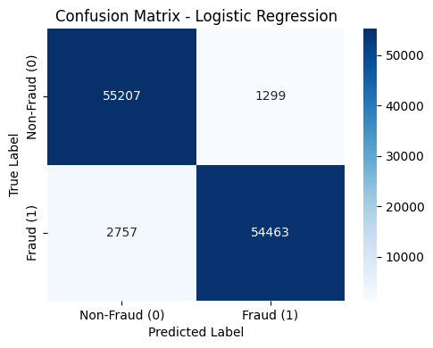
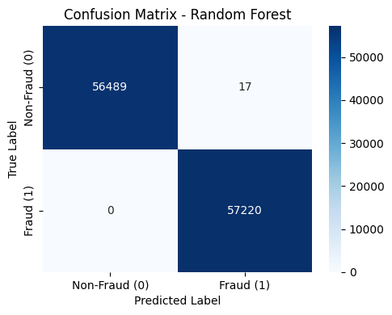

## Credit Card Fraud Detection - Machine Learning Project

During this project, I trained and compared several classification models to detect fraudulent credit card transactions using a 2023 Kaggle dataset. The dataset was already clean and balanced, allowing me to focus on building and evaluating models.

## Project Overview

- **Goal**: Predict whether a credit card transaction is fraudulent.
- **Models Used**: Logistic Regression, Random Forest, XGBoost.
- **Dataset Source**: [Credit Card Fraud Detection Dataset 2023 - Kaggle](https://www.kaggle.com/datasets/nelgiriyewithana/credit-card-fraud-detection-dataset-2023)

---

## Files

- `fraud_detection.ipynb` — main notebook with preprocessing, training, and evaluation
- `README.md` — this file

---
##  Dataset Details (from Kaggle)

- **Transactions**: 568,630
- **Classes**: 0 = Non-fraudulent, 1 = Fraudulent
- **Features**: 30 features (anonymized features (V1 to V28), `id`, and `Amount`)
- **Balanced**: 50% fraud, 50% non-fraud

---

## Model Used 

Since the dataset contains 568,630 transactions, it is considered large, which means we can use more complex and powerful models that benefit from larger amounts of data. I started with Logistic Regression because it is a simple and interpretable model that serves as a good baseline to evaluate performance. Then, I selected Random Forest, which is a tree-based ensemble model known for its robustness to noise and irrelevant features, which is useful here because the dataset has 30 anonymized features (V1–V28) that may contain hidden or less meaningful information. Random Forest is also efficient on large tabular datasets like this. Next, I used XGBoost, a gradient boosting model that typically outperforms Random Forest in terms of accuracy and efficiency on structured data. XGBoost handles imbalances, irrelevant features, and nonlinear patterns effectively, making it a top performer for many classification tasks. Although the dataset is balanced (50% fraud, 50% non-fraud), I still wanted to use XGBoost because of its overall strong performance and flexibility with large feature sets. These three models give me a strong mix of simplicity, interpretability, and high performance to compare and evaluate.

--
## Metrics used 

To evaluate the performance of the classification models, I used a combination of accuracy, F1 score, and confusion matrix. Since the dataset was balanced, where both fraud and non-fraud cases are represented fairly equally, accuracy can be a meaningful metric here.

Accuracy was the primary metric used to gauge the overall performance of the models. It measures the proportion of correct predictions (both fraud and non-fraud) to the total predictions made. Since the dataset is balanced, accuracy provides a reliable measure of how well the model distinguishes between fraud and non-fraud cases.

The F1 Score was also included to ensure a balanced consideration of precision and recall. While accuracy gives a good overall picture, the F1 score is particularly useful when you want to account for both false positives and false negatives. In fraud detection, it’s important to minimize both the risk of incorrectly flagging legitimate transactions as fraud (false positives) and the risk of missing actual fraud cases (false negatives). The F1 score ensures that the model performs well in both areas, even when the dataset is balanced.

The confusion matrix was used to visualize the performance of each model in more detail. It provides the count of true positives, false positives, true negatives, and false negatives. This allows us to understand not just how many predictions were correct, but what types of errors the model is making, which is crucial in fraud detection where the cost of misclassification is high.

By using a combination of these metrics, I was able to gain a more comprehensive understanding of each model's performance. While all models performed well in terms of accuracy, the F1 score provided additional insights into how well the models handled fraud cases, with XGBoost achieving the highest balance between precision and recall.

--
## Model Comparison

- Logistic Regression : 96.43%
-  Random Forest : 99.99%
-   GBoost : 99.97%

## Visualizations

### Class Distribution
A countplot was created to confirm that the dataset was balanced:

### Model Accuracy Comparison 

### Confusion Matrix
Each model's confusion matrix was plotted to evaluate performance on false positives and false negatives.

---

Thank you for checking out this project! Feel free to explore the notebook to see each model's performance and evaluation.

